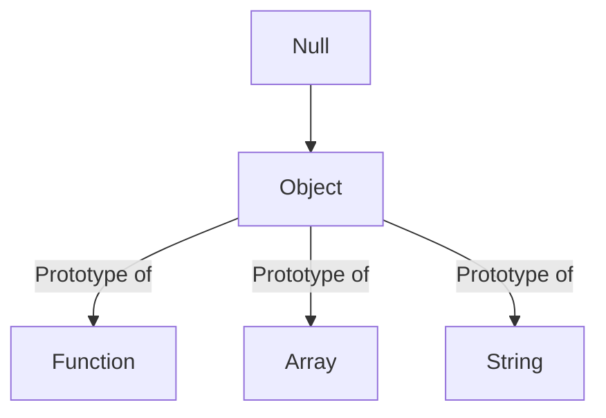

# Javascript and classes
Javascript does have classes but it is mainly a prototype-based-language.

## OOP

## Object
- collection of properties and methods
- toLowerCase()

## why use OOP
- Allows for code readability and modularity.

## Parts of OOP
Object literal: Collection of properties and methods
```javascript
const user = {username: "Pawang Rai", password: "123"}
```

- Constructor function -> Gives a new instance everytime, characterized by the new keyword. Everytime we use the new keyword, this happens

```javascript
function User(username, loginCount, isLoggedIn){
    this.username = username
    this.loginCount = loginCount
    this.isLoggedIn = isLoggedIn
    this.greetings = function(){
        console.log(`Welcome ${this.username}`);
    }
    return this
}

const userOne = new User("Pawang", 12, true)

```

- A new object is created.

- The function User is executed with this bound to the new object.

- Properties (username, loginCount, isLoggedIn, greetings) are assigned to this new object.

- The object automatically gets a hidden prototype (__proto__) that links to User.prototype


- Prototypes
- Classes
- Instances (new, this)

## 4 pillars of OOP
- Abstraction
- Encapsulation
- Inheritance
- Polymorphism

## How everything is linked in Javasript?


- This diagram clearly explains the relationship between javascript objects and functions,arrays and strings.

- Under the hood, Functions, Arrays and Strings and everything in javascript is just an object